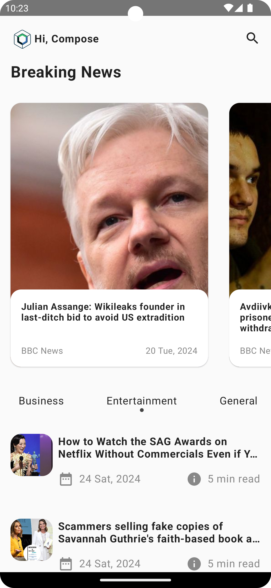
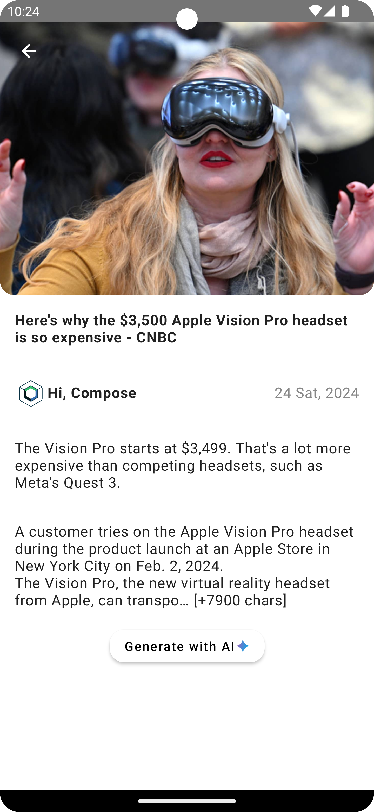
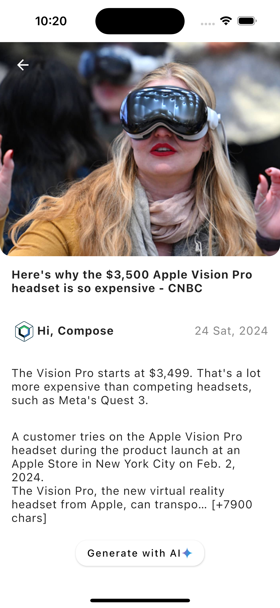
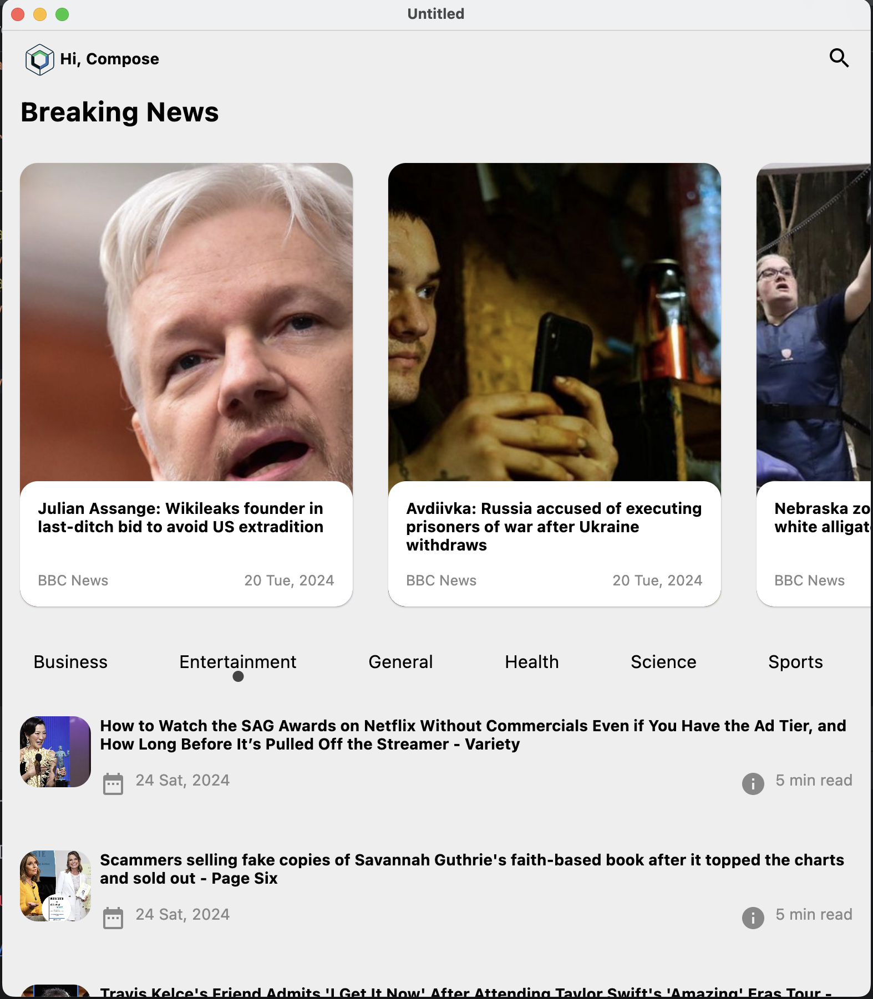
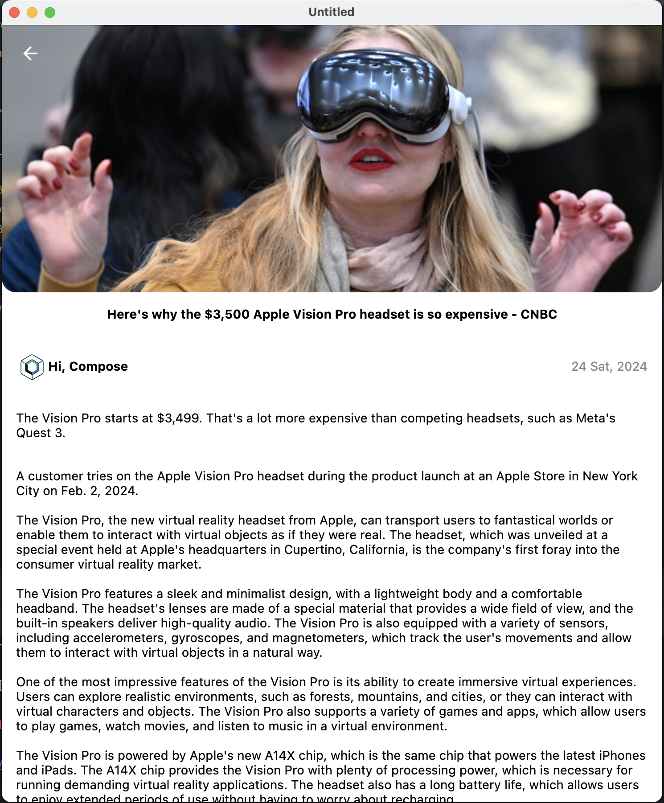

## News App with Compose Multiplatform
This is a _Compose Multiplatform_ project targeting Android, iOS, Desktop.This app allows users to browse through a list of news articles and view their details. Additionally, it integrates Gemini AI to generate extended content for articles with a short summary.

### APIs
- [News API](https://newsapi.org/)
- [Gemini AI](https://ai.google.dev/docs)

```

    ├── composeApp                  
        ├── src
            ├── androidMain
            ├── commonMain
                ├── kotlin
                    ├── core
                    ├── data
                    ├── di
                    ├── model
                    ├── navigation
                    ├── repository
                    ├── ui
                    ├── util
                ├── resources
            ├── desktopMain
            ├── iosMain    
        ├── build.gradle.kts
    ├── gradle                    
    ├── iosApp                     
    ├── screenshots                    
    └── README.md

```
### Add your api keys (News and Gemini API key)
```kt
//Constants.kt

const val NEWS_API_KEY = "Enter your NEWS_API_KEY"
const val GEMINI_API_KEY = "Enter your GEMINI_API_KEY"
```

### Dependencies
- [Jetpack Compose](https://developer.android.com/jetpack/compose/documentation)
- [Ktor client](https://ktor.io/docs/getting-started-ktor-client.html): Http client
- [Coroutines](https://kotlinlang.org/docs/coroutines-guide.html)
- [Koin](https://insert-koin.io/docs/reference/koin-compose/multiplatform): Dependency injection framework.
- [Voyager](https://voyager.adriel.cafe/): A multiplatform navigation library. Also used ScreenModel API that is just like ViewModel. 
- [Kamel](https://github.com/Kamel-Media/Kamel): Image loading library for Compose Multiplatform.
- [Kotlinx - serialization](https://github.com/Kotlin/kotlinx.serialization): Serialization library.

### Screenshots
| Home Screen - Android  | Detail Screen - Android  |  
|:----------------------:| :----------------------: | 
|  </img> | </img> |

| Home Screen - iOS  | Detail Screen - iOS  |  
|:----------------------:| :----------------------: | 
|  </img> | </img> |

| Home Screen - Desktop  | Detail Screen - Desktop  |  
|:----------------------:| :----------------------: | 
|  </img> | </img> |


### Detail screen video
<video width="630" height="300" src="https://github.com/iamsuatzengin/news-app-compose-multiplatform/assets/67907559/1f32ed23-b6fe-443d-8c8f-e0f282fec54c">video</video>
